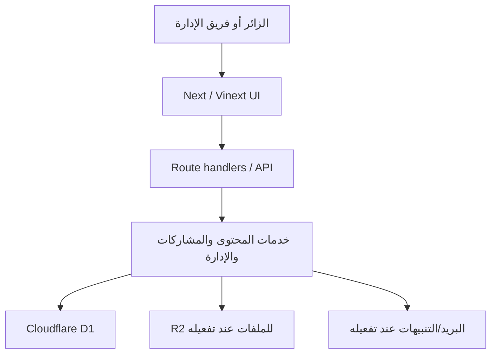

# مواصفة التنفيذ الرئيسية — بوابة أمانة ريادة الأعمال المركزية

> الإصدار: 1.0 · لغة المنصة الأساسية العربية، مع واجهة إنجليزية مستقلة الاتجاه.  
> هذه الوثيقة هي مرجع التنفيذ والتسليم؛ لا يعلن أي جزء «مكتملًا» قبل أن تكون له واجهة، عقد API، خدمة، وتخزين أو مبرر صريح لكونه بنية داخلية.

## 1. هدف المنتج وحدوده

المنتج بوابة عامة قابلة للإدارة لأمانة ريادة الأعمال المركزية بحزب العدل. تخدم أربعة مسارات مترابطة: المعرفة والسياسات، البرامج والفرص، المرصد والتحديات، والمشاركة والشراكات. لا تمثل الصفحة الرئيسية المنتج كله؛ هي مدخل لمسارات ذات روابط وواجهات تفصيلية مستقلة.

المستخدمون: زائر/ة، رائد/ة أعمال، متطوع/ة أو خبير/ة، شريك مؤسسة، مراجع محتوى، محرر، مدير نظام. لا تُنشأ حسابات عامة إلا عندما يُعتمد برنامج عضوية أو تسجيل فعاليات يتطلب تتبعًا شخصيًا. حتى ذلك الحين، جميع النماذج عامة ومحمية بمقاومة إساءة الاستخدام ومراجعة بشرية.

### مبادئ إلزامية

- لا توجد صفحة بلا غرض أو رابط عودة أو حالة فارغة.
- لا يظهر زر يَعِد بعملية غير متصلة بخدمة فعلية.
- النص السياسي أو الاقتراحات التي لم تعتمد تُعرض بصفتها «مسودة» أو «قيد التشاور».
- المحتوى المنشور من قاعدة البيانات؛ المحتوى المضمّن في المستودع عينات عرض/مرجعية فقط ويُستبدل بسجلات إدارة المحتوى عند التشغيل الإنتاجي.
- العربية `ar/rtl` والإنجليزية `en/ltr` وحدتان كاملتان، لا مجرد قلب محاذاة نص.

## 2. المعمارية

| الطبقة | التنفيذ | المسؤولية |
|---|---|---|
| العرض | Next/Vinext + React + CSS tokens + Lucide | صفحات عامة، لوحة الإدارة، حالات التحميل/الخطأ، i18n |
| API | Cloudflare Worker route handlers | عقود JSON، تحقق، صلاحيات، pagination، rate limiting |
| الخدمات | Content, Submission, Media, Knowledge, Admin | منطق الأعمال والربط بين واجهة/تخزين |
| البيانات | Cloudflare D1 عبر Drizzle/SQL | المحتوى، المشاركات، المعرفة، أصول الوسائط، المستخدمون الإداريون |
| الملفات | Cloudflare R2 (مطلوب قبل رفع ملفات من الواجهة) | ملفات وصور وفيديوهات مع مفاتيح غير قابلة للتخمين |
| التشغيل | Sites/Cloudflare + CI | بناء Worker، migrations، أسرار، مراقبة، rollback |

### بنية i18n وRTL/LTR

1. يحدد bootstrap في `app/layout.tsx` `html[lang]` و`html[dir]` قبل الرسم من المسار (`/en/*` = `en/ltr`، غير ذلك = `ar/rtl`).
2. `LocaleProvider` يؤكد الإعداد بعد التنقل من جانب العميل. لا يحتفظ أي مكوّن بحالة اتجاه خاصة به.
3. كل مكوّن يستخدم CSS logical properties (`inline-start/end`, `margin-inline`, `text-align:start`)؛ الأسهم والمؤشرات البصرية فقط تُعكس عند RTL.
4. بيانات المحتوى لها حقل `locale`، والـAPI يجب أن يرشحها صراحة (`locale=ar|en`). لا تُمزج بطاقات العربية والإنجليزية في قائمة واحدة.
5. اختبارات لقطة visual لكل من 360px، 768px، 1280px لكل اتجاه.

## 3. جرد الصفحات

### صفحات عامة منشورة

| المسار | الغرض/المستخدم | المكونات والبيانات | API/الحالات |
|---|---|---|---|
| `/` | مدخل للزائر | Hero، خدمات، فئات مستخدمين، مرصد، أخبار، برامج، CTA | `GET /api/content`; loading skeleton، fallback مصرح، روابط صالحة |
| `/about` و`/about/*` | تعريف القيادة/الفريق/الهيكل/المحافظات | PageHero، prose، بطاقات فريق | محتوى type=`team/resources`; empty/error |
| `/programs`, `/initiatives`, `/opportunities`, `/startup-support`, `/sme-support`, `/success-stories` | رائد/شريك | listing، تصنيف، بحث، pagination، detail | `GET /api/content?type=`؛ loading/empty/retry |
| `/observatory`, `/observatory/problems`, `/observatory/solutions`, `/observatory/policies` | رائد/باحث | workflow، قوائم مشكلات، status، detail | Content + `POST /api/submissions`؛ forbidden فقط للإدارة |
| `/insights`, `/insights/reports`, `/insights/research`, `/insights/publications`, `/resources`, `/documents` | باحث/زائر | متصفح مكتبة، tags، تفاصيل، روابط تنزيل | Content/Media؛ empty/error/not-found |
| `/news`, `/events`, `/events/upcoming`, `/events/past`, `/calls`, `/media/photos`, `/media/videos` | زائر | feed، filters، detail، CTA | Content/Media؛ loading/empty/error |
| `/join`, `/volunteer`, `/submit/idea`, `/submit/problem`, `/submit/proposal`, `/contact`, `/partnerships` | مشارك | نموذج، consent، نجاح/خطأ validation | `POST /api/submissions`; submit pending/success/network retry |
| `/faq` | زائر | accordion وروابط مسارات | static/CMS FAQ؛ empty غير مطلوب |
| `/search?q=` | زائر | input، نتائج، pagination | `GET /api/content?q=`؛ no-results/error |
| `/en/*` | قارئ إنجليزي | shell LTR ونسخ الصفحات المترجمة | `locale=en`; loading/empty/error مستقلة |
| `/:section/:slug` و`/:section/:slug/:item` | قارئ محتوى | breadcrumbs، detail، related CTA | `GET /api/content?slug=`؛ 404 عند غياب المنشور |

### صفحات داخلية

| المسار | الدور | الوصول | الحالة الحالية/المطلوب |
|---|---|---|---|
| `/admin` | محرر/مراجع/مدير | authenticated staff | موجود، ويجب استبدال إدخال token يدويًا بجلسة staff قبل الإنتاج |
| `/admin/content/:id/edit` | محرر | `content:update` | **MISSING → BUILD FRONTEND FIRST**؛ نموذج تعديل مع preview وautosave draft |
| `/admin/submissions/:id` | مراجع | `submission:review` | **MISSING → BUILD FRONTEND FIRST**؛ تحويل حالة، ملاحظات داخلية، audit |
| `/admin/media/upload` | محرر | `media:write` | **MISSING → BUILD FRONTEND FIRST**؛ presigned upload إلى R2 |
| `/admin/analytics` | مدير | `analytics:view` | **MISSING → BUILD FRONTEND FIRST**؛ مؤشرات مجمعة بلا بيانات شخصية غير لازمة |

### صفحة قابلة للتفعيل لاحقًا، لا تُعرض قبل اكتمالها

`/account/*` (تسجيل/دخول/تحقق بريد/إعادة كلمة مرور/ملف شخصي) لا تُنشأ في النسخة العامة الحالية لأن النماذج لا تتطلب حسابًا. عند اعتمادها تبنى الواجهة أولًا ثم المزود والـRBAC؛ لا يضاف زر «حسابي» قبل ذلك.

## 4. تصميم الواجهة

### نظام التصميم

| عنصر | معيار |
|---|---|
| الهوية | الأحمر الرسمي `#CC0000`، الأحمر المضيء `#F20508`، أسود `#171717`، ورق `#F8F8F6` |
| الخط | Cairo للعربية؛ Arial/system للإنجليزية؛ نص أساسي 16px أو أكبر |
| spacing | 4/8/12/16/24/32/48/72/96px |
| breakpoints | 0–620 هاتف، 621–1000 لوحي، 1001–1240 سطح مكتب، 1240+ واسع |
| الشبكة | حد محتوى 1240px، 12 عمود سطح مكتب، 4 هاتف |
| الحركة | 180–350ms، `prefers-reduced-motion` يوقف الحركة الانتقالية؛ لا حركة تعيق القراءة |
| الوصول | HTML دلالي، focus ظاهر، labels للنماذج، alt للصور، contrast AA، لوحة مفاتيح للـmega menu/drawer |

المكوّنات المشتركة: `SiteShell`, `LocaleProvider`, `PageHero`, `Breadcrumbs`, `ContentCard`, `ContentBrowser`, `EmptyState`, `SubmitForm`, `ChatAssistant`, `AdminDashboard`. لا تُنشأ نسخة CSS منفردة لاتجاه واحد؛ كل مكوّن يتلقى اللغة/الاتجاه من الجذر.

### حالات كل واجهة بيانات

- **Loading:** skeleton أو loading bar، لا صفحة بيضاء.
- **Empty:** تفسير قصير + رابط لمسار مناسب أو إزالة filter.
- **Error/network:** رسالة لا تكشف تفاصيل الخادم + زر إعادة المحاولة.
- **Not found:** 404 مع الرجوع لقسم المحتوى.
- **Success:** رقم مرجعي للمشاركة ورسالة تحدد أنها قيد المراجعة، لا وعد زائف بقبولها.
- **Validation:** قرب الحقل، مع `aria-describedby`، ويحفظ الإدخال عند فشل الشبكة حيث أمكن.

## 5. خدمات الخلفية وعقد الـAPI

### خدمات

| الخدمة | مسؤولياتها | المستهلك |
|---|---|---|
| ContentService | نشر/مسودة، slug، locale، tags، البحث والترتيب | lists/details/search/admin |
| SubmissionService | حفظ فكرة/تحد/اقتراح/تواصل، منع التكرار، lifecycle | النماذج/المراجعين |
| MediaService | metadata، R2 object keys، alt، حذف آمن | media/admin |
| KnowledgeService | معرفة مساعد الدردشة مع status ومراجعة | chatbot/admin |
| AdminService | RBAC، audit، metrics، إعدادات | admin |
| NotificationService | بريد/queue للطلبات والفعاليات | internal only |

### endpoints المعتمدة

| Method | Endpoint | صلاحية | العقد المختصر |
|---|---|---|---|
| GET | `/api/content?type&slug&q&page&limit&locale` | public | `{items,page,limit,total}`؛ `type` ضمن enum، limit 1–50 |
| POST | `/api/submissions` | public + rate limit | `{kind,name?,email?,body,consent}`؛ 201 `{id,status}`؛ 400/409/429 |
| POST | `/api/chat` | public + rate limit | `{message,locale,contextPath?}`؛ 200 `{answer,sources?}`؛ لا ينشئ سياسة من تلقاء نفسه |
| GET/POST/PATCH/DELETE | `/api/admin/content` | `content:*` | CRUD من schema، slug/locale unique، soft delete في الإنتاج |
| GET/POST/PATCH | `/api/admin/:resource` | permission بحسب المورد | `media`,`knowledge`,`users`,`submissions`؛ pagination وaudit |
| GET | `/api/admin/summary` | `analytics:view` | counts مجمعة فقط |
| POST | `/api/uploads/sign` | `media:write` | **MISSING → BUILD WITH R2**؛ content type/size validation ثم presigned URL |

أخطاء موحدة: `{error:{code,message,requestId,fields?}}`. جميع الـGET القابلة للفهرسة تستخدم cache-control ملائم مع invalidation عند النشر. جميع القوائم تقبل `page`, `limit`, `sort`, `category`, `tag`, `locale` بعد تنفيذها بالخدمة، لا في متصفح العميل فقط.

## 6. نموذج البيانات

| الجدول | الحقول الرئيسية والعلاقات | فهارس/قيود |
|---|---|---|
| `portal_content` | `id`, `type`, `slug`, `locale`, `title`, `excerpt`, `body`, `category`, `tags`, `cover_image`, `status`, `featured`, `published_at`, audit | unique `(slug,locale)`؛ index `(type,status,published_at)`؛ أضف `deleted_at` للإنتاج |
| `submissions` | `id`, `kind`, `name?`, `email?`, `body`, `status`, `created_at` | index `(kind,status,created_at)`؛ أضف `reviewer_id`,`updated_at`,`ip_hash` |
| `media_assets` | `id`,`kind`,`title`,`r2_key/url`,`alt`,`created_at` | unique `r2_key`؛ ref من content عبر join |
| `knowledge_entries` | `id`,`question`,`answer`,`locale`,`status`,`updated_at`,`reviewed_by` | index `(locale,status)` |
| `admin_users` | `id`,`auth_subject`,`email`,`role`,`created_at`,`disabled_at` | unique `auth_subject`, unique email |
| `roles`,`permissions`,`role_permissions` | many-to-many staff authorization | unique role/permission pair |
| `audit_logs` | actor، action، entity، entity_id، before/after JSON، request_id، time | index entity/time وactor/time |
| `content_media` | content_id ↔ media_id، sort/order، caption | composite PK؛ many-to-many |
| `content_relations` | source content ↔ related content، relation type | composite unique |

العلاقات: admin user 1:N audit logs، role M:N permissions، content M:N media، content M:N content through relations، reviewer 1:N submissions. لا يُحذف محتوى منشور أو أصل وسائط حذفًا نهائيًا؛ soft delete ثم سياسة retention.

## 7. الهوية والصلاحيات

الأدوار: `admin` (إعدادات/أدوار/حذف)، `editor` (إنشاء وتعديل مسودة)، `reviewer` (مراجعة المشاركات/المعرفة)، `publisher` (نشر)، `analyst` (تقارير مجمعة). تتحقق الخدمة من permission لا من اسم الدور فقط.

الوضع الحالي ذو `ADMIN_TOKEN` صالح للتشغيل التجريبي الداخلي فقط، وليس حساب مستخدم. للإنتاج: مزود OIDC/OAuth للموظفين، cookie جلسة آمنة `HttpOnly+Secure+SameSite=Lax`، CSRF للحالات المعتمدة على cookie، تدوير جلسات، MFA للـadmin. حالات staff: invited → active → suspended → deleted؛ الجلسة المنتهية تعيد للـlogin مع حفظ وجهة الرجوع.

## 8. الربط من الصفحة إلى قاعدة البيانات

| الصفحة/المكوّن | API | الخدمة | التخزين |
|---|---|---|---|
| ContentBrowser + ContentCard | `GET /api/content` | ContentService.list/detail | `portal_content`, `content_media` |
| Search | `GET /api/content?q=` | ContentService.search | `portal_content` (+ FTS عند التوسع) |
| SubmitForm | `POST /api/submissions` | SubmissionService.create | `submissions`, `audit_logs` |
| ChatAssistant | `POST /api/chat` | KnowledgeService.answer | `knowledge_entries`, published content |
| Admin content | `/api/admin/content` | ContentService.adminCrud | `portal_content`, audit |
| Admin media | `/api/uploads/sign`, `/api/admin/media` | MediaService | R2, `media_assets` |
| Admin submissions | `/api/admin/submissions` | SubmissionService.review | `submissions`, audit |
| Admin knowledge | `/api/admin/knowledge` | KnowledgeService.adminCrud | `knowledge_entries`, audit |

## 9. الأمن والأداء

- Zod/schema validation لكل body وquery، allowlist للـsort/type، parameterized SQL فقط.
- rate limit على chat/submissions/search؛ honeypot + time-to-submit + hash IP بمدة احتفاظ محدودة للنماذج.
- CORS origin allowlist، security headers، CSP، secrets في بيئة الاستضافة فقط، لا مفاتيح في المستودع.
- uploads: allowlist MIME، حد الحجم، antivirus/asynchronous scan قبل النشر، private R2 by default.
- cursor/page pagination، index للـstatus/type/date، full-text search عند تجاوز D1 LIKE، image resizing/lazy loading، cache للـpublished content.
- jobs: إخطار المراجعين، تذكير المسودات، إعادة فهرسة، clean-up ملفات يتيمة؛ queue لا request طويل.

## 10. الاختبار والتشغيل

| المجال | الاختبارات المطلوبة |
|---|---|
| وحدة/تكامل | validation، slug uniqueness، permissions، lifecycle النشر والمشاركات |
| API | 200/201/400/401/403/404/409/429 وpagination/filter/locale |
| E2E | بحث، إرسال فكرة، فتح detail، drawer الهاتف، نشر محتوى، تغيير لغة |
| Visual | Arabic RTL + English LTR عند 360/768/1280، no overflow أو icon inversion خطأ |
| وصول | keyboard، focus، screen reader labels، contrast، reduced motion |
| أمن | authz matrix، rate limit، CSRF، upload validation، secret scan |

بيئات: `development`, `staging`, `production`. المتغيرات: `ADMIN_TOKEN` (تجريبي فقط)، `AUTH_ISSUER`, `AUTH_AUDIENCE`, `SESSION_SECRET`, `R2_BUCKET`, `NOTIFICATION_*`, `SENTRY_DSN`, `PUBLIC_BASE_URL`. كل deploy: install → type/build → migrations immutable → smoke `/`, `/en`, `/api/content` → promote. احتفظ بنسخة D1 يومية، health endpoint، logs برقم request ID، وrollback إلى deployment السابق مع migration متوافقة forward-only.

## 11. Definition of Done

لا يعتبر الإصدار إنتاجيًا قبل: تفعيل staff authentication الحقيقي، إتمام شاشات الإدارة الموسومة MISSING، إتاحة R2 إذا فُعّل رفع الملفات، زر retry للحالات الشبكية، اختبارات RTL/LTR وE2E، تغطية ترجمات المحتوى الإنجليزي المنشور، وضبط أسرار وإشعارات ومراقبة الإنتاج. النسخة الحالية تشغّل البوابة والمحتوى والمشاركات ولوحة التشغيل على D1؛ البنود السابقة هي فجوات إنتاجية مصرح بها وليست خصائص مكتملة ادعاءً.
